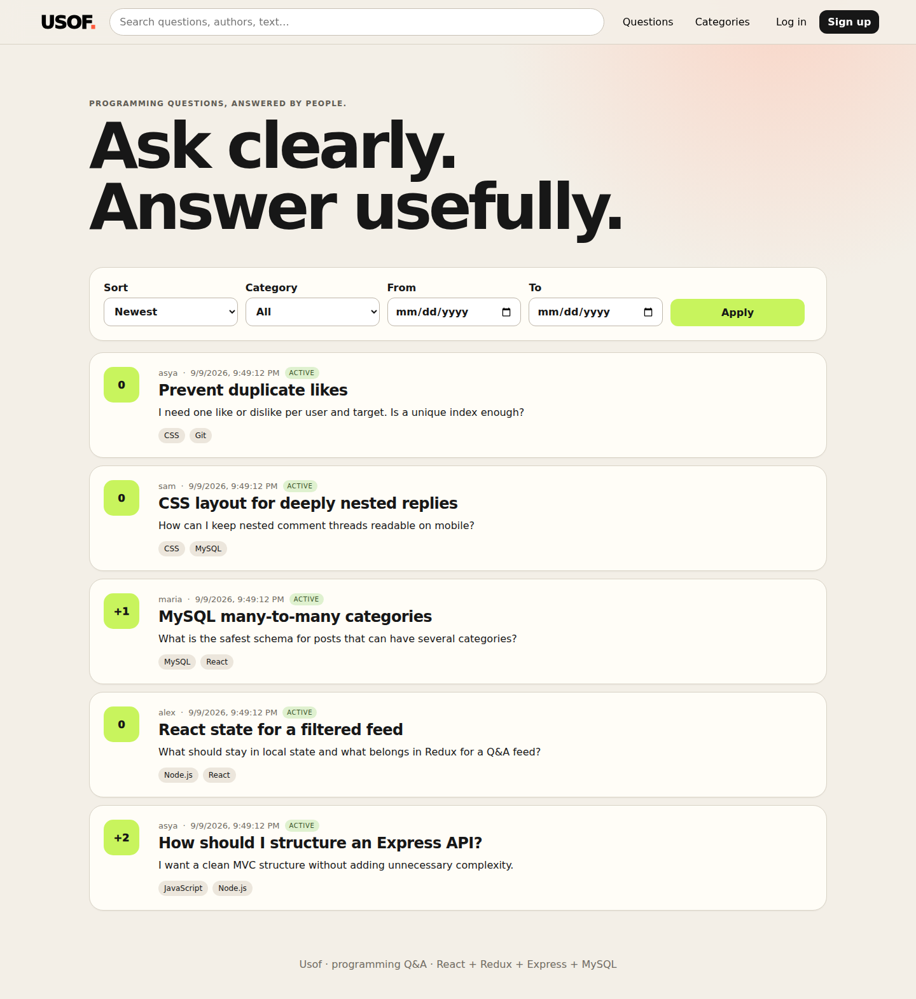
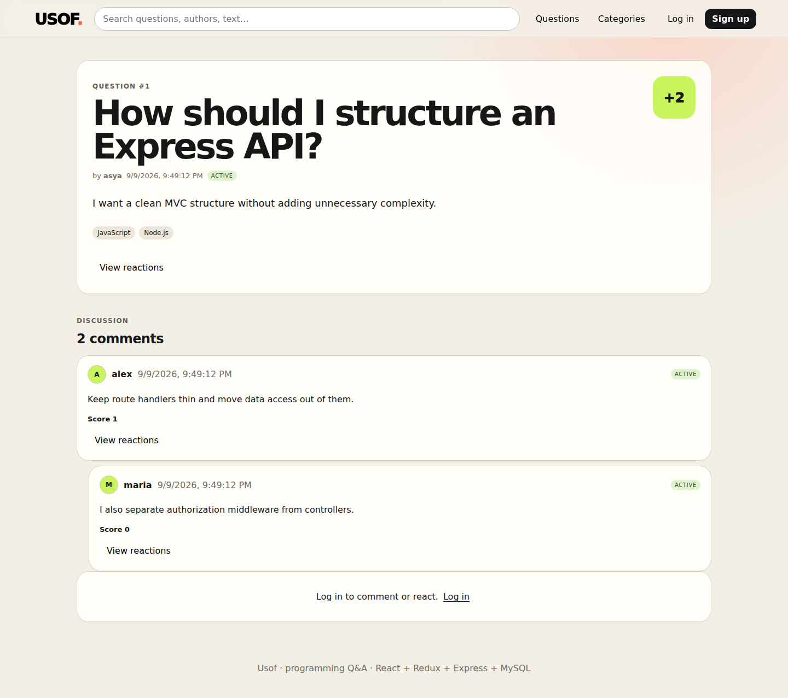
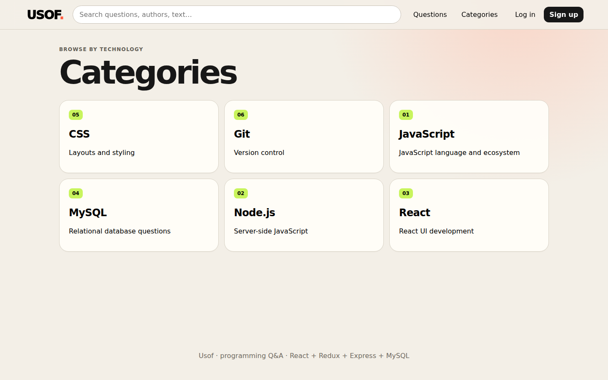
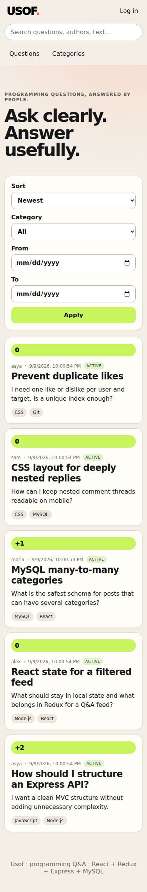

# Usof


Usof is a local full-stack programming Q&A service inspired by Stack Overflow. It combines a Node.js/Express/MySQL API with a responsive React + Redux client and follows the required `API/` + `web/` repository layout.

## Features

- registration, email verification, login, real logout and password reset
- `user` and `admin` roles with backend authorization and ownership checks
- user profiles, avatar upload, account deletion and automatically maintained reputation
- posts with many-to-many categories, active/inactive moderation, locking, search, sorting, filtering and pagination
- nested comments through `parent_comment_id`, moderation and locking
- `like`, `dislike`, `useful`, `thanks` and `fire` reactions with one reaction per user/target and no self-voting
- saved questions, followed discussions and notification inbox
- tracked native/copy/Facebook/X/Telegram sharing and a recent-activity Trending feed
- trust levels, community rank, weekly answer goal, streaks, achievements and questions worth answering
- separate user contribution dashboard and admin platform dashboard
- admin user/category/post/comment management in a dedicated moderation console
- responsive React UI covering guest, user and admin flows
- centralized JSON errors, input validation and parameterized SQL
- GitHub Actions verification with MySQL 8.4, Basic/Creative API smoke flows, a PDF-specific backend requirement audit, React production build and real browser screenshots

## Stack

JavaScript, Node.js, Express, MySQL, HTML, CSS, React and Redux.

No third-party UI framework is used.

## Requirements

- Node.js 20+
- npm 10+
- MySQL 8+

## Setup

```bash
git clone https://github.com/Anastasia2627/usof.git
cd usof
npm install
cp .env.example .env
```

Edit `.env` with your local MySQL credentials and a strong `AUTH_SECRET`.

Initialize the development database. This recreates the tables inside the configured `DB_NAME`, so use a dedicated development database:

```bash
npm run db:init
```

Start the API:

```bash
npm start
```

In a second terminal, start the React client:

```bash
npm run web
```

Open `http://localhost:5173`.

## Seed accounts

Development seed password for all accounts: `Password123!`

- `admin` / `admin@usof.local` — admin
- `asya` / `asya@usof.local` — user
- `alex` / `alex@usof.local` — user
- `maria` / `maria@usof.local` — user
- `sam` / `sam@usof.local` — user

Do not use these credentials outside local development.

## API overview

- `/api/auth` — registration, verification, login/logout and password reset
- `/api/users` — profiles, avatar upload, account deletion and admin user management
- `/api/posts` — post CRUD, pagination, sorting/filtering, reactions, comments, saves, follows and sharing
- `/api/categories` — category CRUD and posts by category
- `/api/comments` — admin listing, comment moderation, reactions and deletion
- `/api/library` — saved and followed questions
- `/api/notifications` — personal discussion/reaction notifications
- `/api/dashboard/me` — user contribution, trust and answer-suggestion dashboard
- `/api/dashboard/admin` — admin analytics and moderation overview

The post feed supports `page`, `limit`, `sort=likes|date|trending`, `order=asc|desc`, `category`, `from`, `to`, `status`, `author` and `search`. `sort=likes` means positive like count and remains the Basic default required by the backend PDF. Visibility and role rules are enforced by the API.

For routes, permissions and payload notes, see [docs/API.md](docs/API.md). For the exhaustive backend-PDF requirement matrix, see [docs/BACKEND_COMPLIANCE.md](docs/BACKEND_COMPLIANCE.md). The additional community layer is described in [docs/CREATIVE_FEATURES.md](docs/CREATIVE_FEATURES.md).

## Frontend pages and flows

The React client includes the home feed with search/filters/pagination and Trending sorting, login, registration, email verification, password reset, category browsing/detail pages, profile editing, avatar upload, account deletion, create/edit post, post details, nested replies, five reaction types, saved/followed question libraries, notifications, user dashboard, admin dashboard and an admin console for users, posts, categories and comments.

The header/menu is present on every page and shows the service name, search, navigation and — for authorized users — current role, login, avatar, notification indicator and logout.

### Community and trust layer

Reputation is based on reactions received on questions and answers. Users cannot react to their own contribution. Trust levels provide a readable interpretation of reputation: Newcomer, Contributor, Trusted, Expert and Mentor.

The user dashboard is designed to encourage useful participation rather than raw activity. It shows weekly answer progress, contribution streak, achievements, reaction feedback, community rank and questions the user has not answered yet. The admin dashboard stays separate and focuses on platform totals, seven-day activity, top contributors/categories, reaction mix and moderation context.

## Architecture

Backend request flow:

`HTTP request → route → auth/validation → controller/service/model → MySQL → JSON response`

The backend separates configuration, middleware, controllers, entity models, engagement/notification/dashboard services, database initialization and uploads. React uses a central API client and Redux only for global authentication/session state; page-specific forms, filters, pagination and dashboard state remain local component state.

More detail is available in [docs/ARCHITECTURE.md](docs/ARCHITECTURE.md).

## Testing

Run syntax checks and the full smoke suite while MySQL/API are available:

```bash
npm run check:backend
npm run test:smoke
npm run build
```

Individual backend verification layers can also be run separately:

```bash
npm run test:requirements
npm run test:creative
```

The Creative smoke suite verifies saved/followed questions, sharing validation, expanded reactions, self-vote protection, reputation changes, follower/author notifications, comment ordering by positive likes, community rank, dashboards and Trending metadata.

GitHub Actions independently starts MySQL 8.4, recreates and seeds the database, checks backend syntax, starts the API, runs public/authenticated Basic + Creative smoke flows and the strict backend requirement audit, builds the React client, starts the real frontend and captures desktop/mobile screenshots.

## Documentation / CBL progress

- **Engage:** defined Usof as a knowledge-exchange service for programmers.
- **Investigate:** selected the required Node.js/Express/MySQL + React/Redux stack and a role-aware API architecture.
- **Act:** implemented the database schema, backend modules, responsive client, validation, security checks, community features, dashboards, admin workflows and automated verification.

The fuller stage-by-stage development journal and reflection are in [docs/CBL.md](docs/CBL.md).

Main user flow: open app → register → verify email → login → browse/filter posts → answer/reply → react → save/follow discussions → check notifications/dashboard → edit own content/profile → logout.

Main admin flow: login → open admin dashboard → inspect platform/moderation signals → open admin console → manage users/roles → moderate posts/comments → manage categories → inspect reactions → logout.

For a requirement-by-requirement peer-assessment map and quick demo sequence, see [docs/ASSESSMENT.md](docs/ASSESSMENT.md).

## Screenshots

These are real screenshots captured automatically from the running application in GitHub Actions.

### Desktop home



### Question and nested discussion



### Categories



### Mobile home



## Verification status

The automated pipeline verifies database initialization/seed, backend syntax, API startup, public/authenticated Basic + Creative smoke flows, the PDF-specific backend compliance suite, React production build, real frontend startup and browser rendering at desktop/mobile widths. The committed screenshots are produced from that same running application rather than generated mockups.
